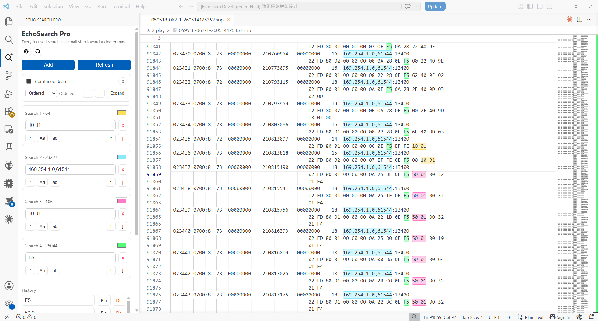
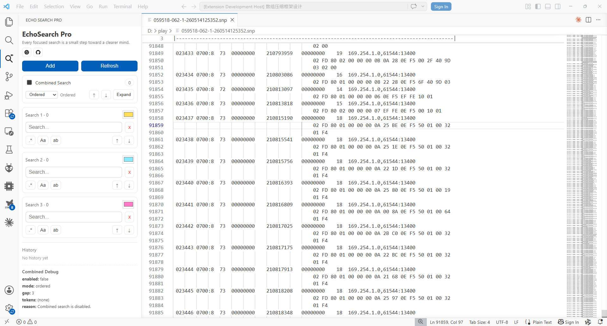
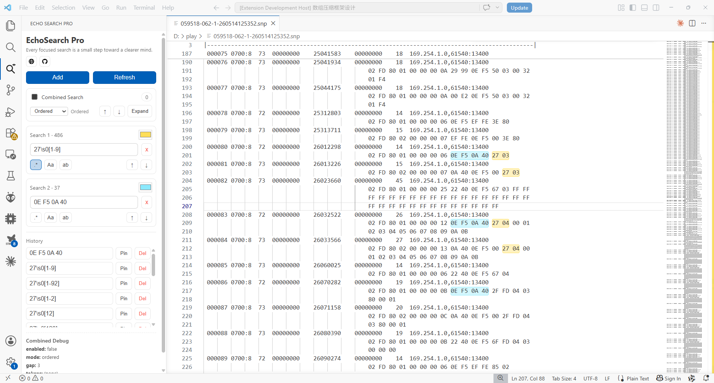
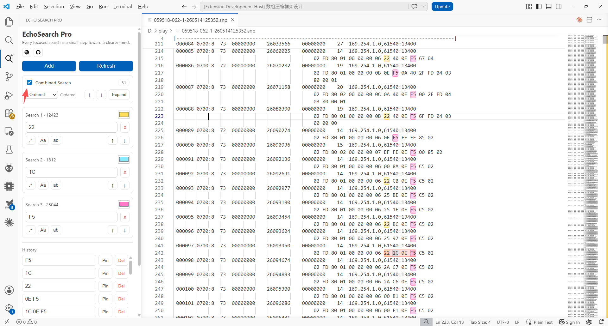
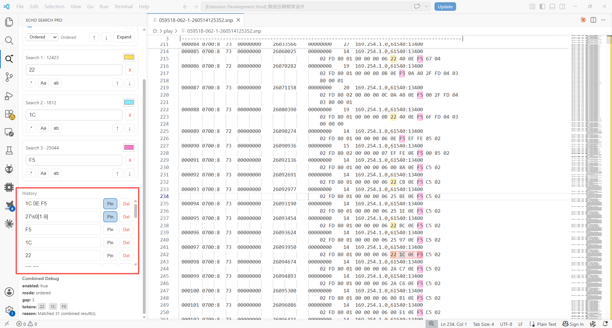

# 🔍EchoSearch Pro

## 从“Ctrl+F来回切换”到“多条件并行分析”：我做了一个 VS Code 搜索增强插件

> 当日志开始变成“大浪淘沙”时，传统搜索已经不够用了。
>
> flechazo.mba by flechazo一个有情怀的程序员
>
> https://github.com/FlechazoCLF

------

# 👀 先看效果



# 📖 缘起

最近在做基于 AUTOSAR 的 DCM、Bootloader 和 OTA 相关开发。

在家里压测功能时一切正常，但每次一上车，就开始变得奇怪：

- ❌ 有概率刷写失败
- ❌ 会话切换异常
- ❌ 27 服务解锁失败
- ❌ 某些 CAN 报文偶发丢失
- ❌ 状态机顺序异常

于是问题就变成了：

> “如何从几十万行日志里，把真正有价值的信息捞出来？”

而最痛苦的一件事就是：

🔄 你会不断在多个关键词之间来回切换搜索。

例如：

- 搜索 `0E F5 EF FE`
- 再搜索 `10 01`
- 然后看看 `10 03`
- 再查 `27`
- 接着又想回到 `10 01`

整个过程会变得非常乱。

------

原生 `Ctrl+F` 并不是不好，而是：

> 它更适合“单点快查”，而不是“多线并行分析”。

于是，我做了这个插件：

# ✨ EchoSearch Pro

一个面向 VS Code 的增强搜索插件。

它不是替代原生 `Ctrl+F`，而是把：

> “单条件单视角搜索”

升级成：

> “多条件并行搜索”。

------

# 🤔 为什么我会做这个插件？

在 AUTOSAR、UDS、CAN、Bootloader 这些场景里：

日志分析往往不是：

- 🔍 “找一个词”

而是：

- 🧠 “同时观察多个上下文”

例如：

| 你想观察的内容   | 示例              |
| ---------------- | ----------------- |
| 🔄 会话切换       | `10 01` / `10 03` |
| 🔐 SecurityAccess | `27 01` / `27 02` |
| 🚗 某个 ECU       | `0E F5 EF FE`     |
| ⚠️ NRC 错误码     | `7F`              |
| 🧾 某个 traceId   | `8A2F...`         |

这些东西之间是有关联的。

------

但传统搜索的问题是：

- ❌ 一次只能关注一个条件
- ❌ 搜索框需要来回切换
- ❌ 上下文容易丢失
- ❌ 很难形成“全局观察”

于是我就开始思考：

> 能不能像抓包工具一样，同时高亮多个关键词？

于是 EchoSearch Pro 就诞生了。

------

# 🧠 插件核心理念

EchoSearch Pro 的核心目标只有一句话：

> “让搜索从单线程，变成多线程。”

它允许你：

- ✅ 同时维护多个搜索框
- 🎨 每个搜索框独立高亮颜色
- 📊 独立统计命中数量
- ⬆️⬇️ 独立上下跳转
- 🧩 独立正则规则
- 🔠 独立大小写控制

最终形成：

> “多维度同时观察日志”的能力。

------

# 🔥 功能演示

------

# 1️⃣ 多搜索框并行搜索

传统 Ctrl+F：

你只能一次搜一个关键词。

EchoSearch Pro：

你可以同时搜索：

- `10 01`
- `10 03`
- `27`
- `7F`
- `0E F5 EF FE`

并且：

- 🎨 每个搜索条件都有独立颜色
- ✨ 同时高亮
- 📈 同时统计命中

这样看日志时会非常清晰。

------



------

# 2️⃣ 独立颜色高亮

不同搜索条件会使用不同颜色进行高亮。

例如：

| 关键词  | 颜色   |
| ------- | ------ |
| `10 01` | 🔵 蓝色 |
| `10 03` | 🟢 绿色 |
| `27`    | 🔴 红色 |
| `7F`    | 🟡 黄色 |

这样可以快速区分：

- 📨 请求
- 📩 响应
- ⚠️ 错误
- 🔄 状态切换

阅读日志时负担会小很多。

------


------

- # 3️⃣ 支持正则表达式

  有些时候：

  你并不知道完整内容。

  例如：

  - 某个 CAN ID 开头
  - 某段 traceId
  - 某类错误码

  这时候就可以启用：

  ```regex
  .*
  ```

  进入正则模式。

  例如：

  ```regex
  27\s0[12]
  ```

  匹配：

  - ✅ `27 01`
  - ✅ `27 02`

  或者：

  ```regex
  7F\s..\s78
  ```

  匹配：

  - ⚠️ 所有 Response Pending

------



------

# 4️⃣ 模糊组合搜索（核心功能）

这个功能其实是我做插件的核心原因之一。

例如：

我想搜索：

```text
0E F5 EF FE
```

但日志里：

- 空格可能不同
- 数据格式可能变化
- 中间可能夹杂额外字段

传统搜索可能不好找。

于是我希望：

只要：

- 出现 `0E`
- 出现 `F5`
- 出现 `FE`

就能匹配。

于是我设计了：

> 🧠 “组合搜索模式”

你可以：

- 搜索 `0E`
- 搜索 `F5`
- 搜索 `FE`

然后启用：

✅ 组合搜索

即可实现类似：

> “模糊关联搜索”

这对日志分析非常有帮助。

------



------

# 5️⃣ 独立上下跳转

每个搜索框都有：

- ⬆️ 上一个
- ⬇️ 下一个

按钮。

你可以：

只在某一类匹配之间跳转。

例如：

- 只跳转 `27`
- 不影响 `10 01`

这个在分析时特别舒服。

------

📌 这里建议放一个 GIF，效果会非常明显。

------

# 6️⃣ 搜索历史记录

所有搜索记录都会保存：

```text
.echosearch/history.json
```

支持：

- 📌 历史置顶
- ♻️ 历史复用
- 🗑️ 删除记录

例如：

常用：

- `10 01`
- `10 03`
- `27`
- `7F`

可以长期保留。

下次打开工程直接继续分析。

------



------

# 7️⃣ 支持最多 10 个搜索框

默认提供 3 个。

但你可以继续增加。

最多支持：

```text
10 个并行搜索框
```

适合：

- 🚗 大型日志分析
- 🔗 协议联调
- 📡 OTA流程追踪
- 🧩 多模块联动分析

------


------

# 🎯 这个插件适合谁？

## 👨‍💻 嵌入式开发

例如：

- CAN
- UDS
- AUTOSAR
- OTA
- Bootloader

日志分析场景。

------

## 🌐 后端日志分析

例如：

- traceId
- requestId
- error
- timeout

并行定位。

------

## 🛠️ 大型代码重构

同时观察：

- 旧实现
- 新实现
- API调用链

------

## 📡 协议解析

同时观察：

- 请求
- 响应
- NRC
- Session
- SecurityAccess

------

# 🏗️ 技术架构

整个插件主要分为：

| 模块               | 作用                   |
| ------------------ | ---------------------- |
| `src/extension.ts` | VS Code Extension Host |
| `media/main.js`    | Webview UI             |
| `media/main.css`   | 样式                   |

核心逻辑：

- 🖥️ Webview 管理 UI
- 🧠 Extension Host 管理状态
- 🎨 Decoration 实现高亮
- 🔄 Message 通信同步数据

------

# ⚡ 关于性能

因为高亮本质依赖：

```ts
TextEditorDecorationType
```

所以我重点做了：

- ⚡ debounce（120ms）
- 👀 可见 editor 范围更新
- ♻️ decoration 复用
- 🧹 历史去重

目前：

即使大日志文件也能保持比较流畅。

------

# 🚧 我后续还想做什么？

## 1️⃣ 组合逻辑增强

支持：

- AND
- OR
- NOT

例如：

```text
27 AND 7F
```

------

## 2️⃣ 时间窗口搜索

例如：

```text
10 03 后 5 秒内出现 7F
```

------

## 3️⃣ 日志时间轴

把搜索结果变成：

- 📈 时间线
- 🔄 状态流

------

## 4️⃣ 导出分析结果

例如：

```json
{
  "session_switch": 12,
  "security_unlock_fail": 3
}
```

------

## 5️⃣ 协议分析模式

自动识别：

- UDS
- SOME/IP
- CANFD
- DoIP

------

# 🚀 安装方式

```bash
npm install
npm run compile
```

然后：

按：

```text
F5
```

启动 VS Code Extension Development Host。

------

# ❤️ 最后

这个插件其实来源于一个很真实的问题：

> “日志太多了，而传统搜索太单线程。”

很多时候：

我们真正需要的并不是：

> “查一个词”

而是：

> “同时观察多个关联上下文”。

EchoSearch Pro 本质上是在解决：

> “并行观察能力”。

如果你也经常：

- 🔍 查日志
- 📡 抓协议
- 🚗 做 OTA
- 🔧 看 Bootloader
- 🧠 分析 AUTOSAR 通信

也许它会对你有帮助。
